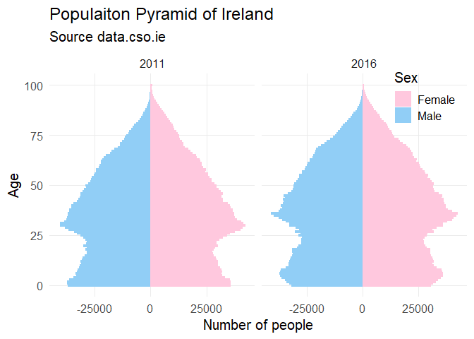

Using R and data.cso.ie
================
d lynch
1/31/2020

## Using R to access the data.cso.ie API

The CSO provides a web interface to download statistical data, available
at [data.cso.ie](https://data.cso.ie). There are three methods provided
to users to interact with the data:

  - Viewing data within a web browser
  - Downloading data through a web browser as either PX, JSON-stat or a
    CSV file format
  - Downloading data with the API

This page will work through an example of calling the API using R. If
you just want the code, skip to the [bottom of the
page](#cso.data.ie_function) where you can find a function which will
extract a dataframe using the API.

Start by loading the required packages

``` r
library(httr)
library(jsonlite)
library(rjstat)
```

### Making an API call

The API uses the [JSON-RPC
protocol](https://en.m.wikipedia.org/wiki/JSON-RPC). This protocol takes
a JSON as a request and returns a JSON as a response. One of the
features of the [data.cso.ie](https://data.cso.ie) page is that the
request JSON is provided to users so that it can simply be copy and
pasted. In order get the JSON code a user selects their data using the
interactive menus. When the selection has been made they can simply
scroll to the end of the webpage and expand the ‘API:Read Dataset’ tab.
From there, copy and paste the ‘URL’ and the ‘JSON-RPC’ query.

The example below is for the ‘Population 2011 to 2016(Number)’ data.
This table gives a breakdown of number of people and gender at every age
in the state. A population pyramid can be constructed from this data.
Note that the `base_url` is the same for all datasets.

``` r
base_url <- "https://ws.cso.ie/public/api.jsonrpc"

query <- '{
  "jsonrpc": "2.0",
  "method": "PxStat.Data.Cube_API.ReadDataset",
  "params": {
    "matrix": "E3002",
    "language": "en",
    "FrmType": "JSON-stat",
    "FrmVersion": "2.0",
    "role": {
      "time": [
        "TLIST(A1)"
        ],
      "metric": [
        "STATISTIC"
        ]
    },
    "dimension": [
      {
        "id": "C02199V02655",
        "category": {
          "index": [
            "1",
            "2"
            ]
        }
      },
      {
        "id": "C02701V03269",
        "category": {
          "index": [
            "-01"
            ]
        }
      },
      {
        "id": "C02786V03355",
        "category": {
          "index": [
            "22"
            ]
        }
      }
      ]
  }
}'
```

The next step is to make a call to the API. The POST method is used, and
a `status_code` of 200 should be returned to confirm that R was able to
communicate successfully with the API.

``` r
request <- POST(url = base_url, body = query, encode = 'json')
print(request$status_code)
```

    ## [1] 200

Now the actual content of the request can be extracted. This can be done
by first extracting the response as text and then then be converting it
to a list using the
(jsonlite)\[<https://cran.r-project.org/web/packages/jsonlite/index.html>\]
package.

If this list contains an ‘error’ tag well that will tell us that the API
has not returned valid data.

``` r
response <- content(request, as = "text", encoding = "UTF-8")
response_list <- fromJSON(response, flatten = TRUE)

print('error' %in% names(response_list))
```

    ## [1] FALSE

### Parsing the API response

The API response has been converted from JSON to a list. The elements of
this list are:

``` r
print(names(response_list))
```

    ## [1] "jsonrpc" "data"    "id"

The element which we are interested in is the `data` element. This
element contains the information which we have requested from the API.
This element is formatted as a list of lists which are formatted using
the JSON-stat protocol. A JSON-stat file can be converted to a dataframe
using the
[rjstat](https://cran.r-project.org/web/packages/rjstat/index.html)
package. However the rjstat expects a JSON object as an argument, not a
R list. Therefore, we need to convert the data element to a JSON, and
then convert that JSON to a dataframe using rjstat.

``` r
# extrarct the data element
data_list <- response_list$data
# convert list to JSON
data_json <- toJSON(data_list)
# convert JSON to dataframe
df <- fromJSONstat(data_json)

knitr::kable(head(df))
```

| Statistic                        | CensusYear | Sex  | Age Last Birthday | Aggregate Town or Rural Area | At Each Year of Age |   value |
| :------------------------------- | :--------- | :--- | :---------------- | :--------------------------- | :------------------ | ------: |
| Population 2011 to 2016 (Number) | 2011       | Male | All ages          | State                        | Population          | 2272699 |
| Population 2011 to 2016 (Number) | 2011       | Male | Under 1 year      | State                        | Population          |   36850 |
| Population 2011 to 2016 (Number) | 2011       | Male | 1 year            | State                        | Population          |   37230 |
| Population 2011 to 2016 (Number) | 2011       | Male | 2 years           | State                        | Population          |   37153 |
| Population 2011 to 2016 (Number) | 2011       | Male | 3 years           | State                        | Population          |   36382 |
| Population 2011 to 2016 (Number) | 2011       | Male | 4 years           | State                        | Population          |   34461 |

Finally, we can make visualisations with our data. A little bit of data
wrangling is required to prepare the data for plotting.

``` r
library(ggplot2)
library(stringr)
library(dplyr)

# The df column names have spaces, replace with _ for easier typing
colnames(df) <- str_replace_all(colnames(df), ' ', '_')

# The ages are 'Under 1 year', '1 year', '2 years'...'100 years and over'
# Convert Under 1 year to 0 years for consistancy
df[which((df$Age_Last_Birthday) == 'Under 1 year'), 'Age_Last_Birthday'] <- '0 years'

# couple of things happening here: Remove the total rows 'All ages'
# Create a new column age_num which is a numeric value for age.
# The result of this is that >100 will be 100, which is not perfect, but good enough
# Also multiply all Male ages by -1 so that they are on the right side of the 
# population pyramid
df <- df %>% 
  filter(Age_Last_Birthday != 'All ages') %>% 
  mutate(age_num = str_extract(Age_Last_Birthday, '[:digit:]*'),
         age_num = as.numeric(age_num),
         value = ifelse(Sex == 'Male', value*-1, value))

# Finally plot the data
ggplot(df, aes(x = age_num,
               y = value,
               color = Sex,
               fill = Sex))+
  geom_bar(stat='identity',
           position = 'stack',
           width = 1)+
  scale_color_manual(values=c("#ffc8de", "#91cef6"))+
  scale_fill_manual(values=c("#ffc8de", "#91cef6"))+
  coord_flip()+
  facet_grid(cols = vars(CensusYear),
             scales = "fixed")+
  theme_minimal(base_size = 15)+
  theme(legend.position = c(0.9, 0.9),
        panel.grid.minor = element_blank())+
  ggtitle('Populaiton Pyramid of Ireland', 'Source data.cso.ie')+
  xlab('Age')+
  ylab('Number of people')
```


## Function to call API from R

This function uses the same method described above and can be used to
call the API from R. It only takes a single argument; a string of the
query which can be copy and pasted from
[data.cso.ie](https://data.cso.ie).

``` r
library(httr)
library(jsonlite)
library(rjstat)


data.cso.ie <- function(query){
  # Function to make a call to the data.cso.ie API and return a dataframe
  
  # Arguments:
  # query is a string which is coppied from the cso.data.ie page
  # After making the selection of data required scroll to the bottom 
  # of the page to 'JSON-RPC query' section and copy the text
  
  # Returns:
  # A dataframe
  
  # The URL for the API
  base_url <- "https://ws.cso.ie/public/api.jsonrpc"
  
  # POST request to get the data
  request <- POST(url = base_url, body = query, encode = 'json')
  
  # Confirm that a response was recieved from the API
  if (request$status_code != 200){
    stop('There is an error contacting API. ',
         'This issue is not related to the query.')
  }
  
  # Extract the content of the response as text
  response <- content(request, as = "text", encoding = "UTF-8")
  
  # convert the response text to a list
  response_list <- fromJSON(response, flatten = TRUE)
  
  
  # Check if the API returned an error message. This can be detected by the 
  # presence of the error tag in the response list
  if ('error' %in% names(response_list)){
    
    error_code <- response_list$error$code
    error_msg <- response_list$error$message
    
    cat('API returned an error. This is most likely a result of a problem in the query\n',
        'Error code: ', error_code, '\n',
        'Error message: "', error_msg, '"\n',
        sep='')
    
    stop('excetuion halted due to error in API response')
  }
  
  # ********** Converting the response to JSON-Stat format **************
  # The response is in the format of a json file. Nested Within the json file is 
  # a JSON stat file. To extract this JSON stat we need to do the following
  # 0. Completed above. Convert the JSON to a list. The result is a list of nested lists
  # 1. Extract the relevant part of the list. The required element is named 'data'
  # 2. Convert this 'data' list back to a JSON file. This new json is formated 
  #     according to the JSON-stat rules.
  # 3 Convert the 'data' element to a dataframe using the rjstat package

  # 1. Extract 'data' list from response_list
  data_list <- response_list$data
  
  # 2. convert data_list to data_json
  data_json <- toJSON(data_list)
  
  # 3. convert data_json to dataframe and Return 
  fromJSONstat(data_json)  
}
```
